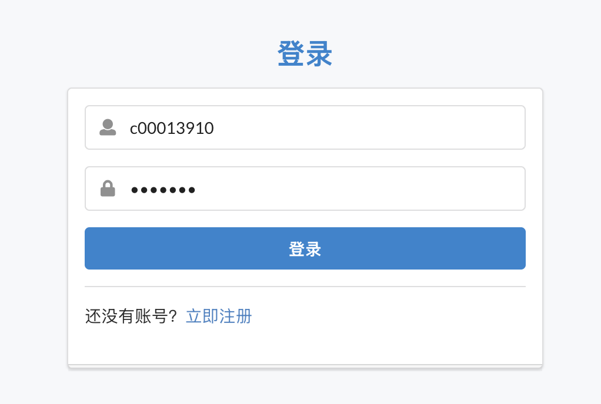
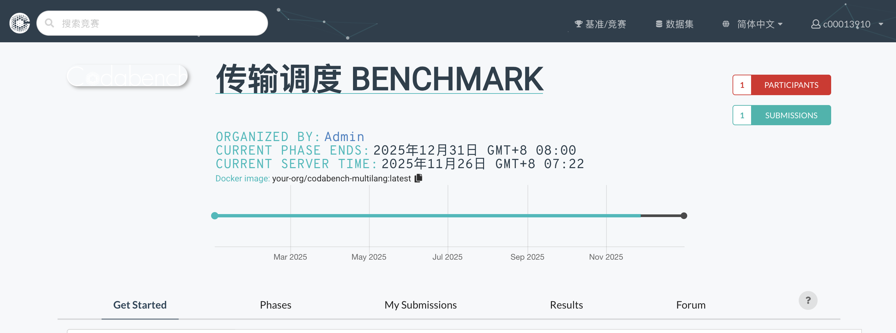
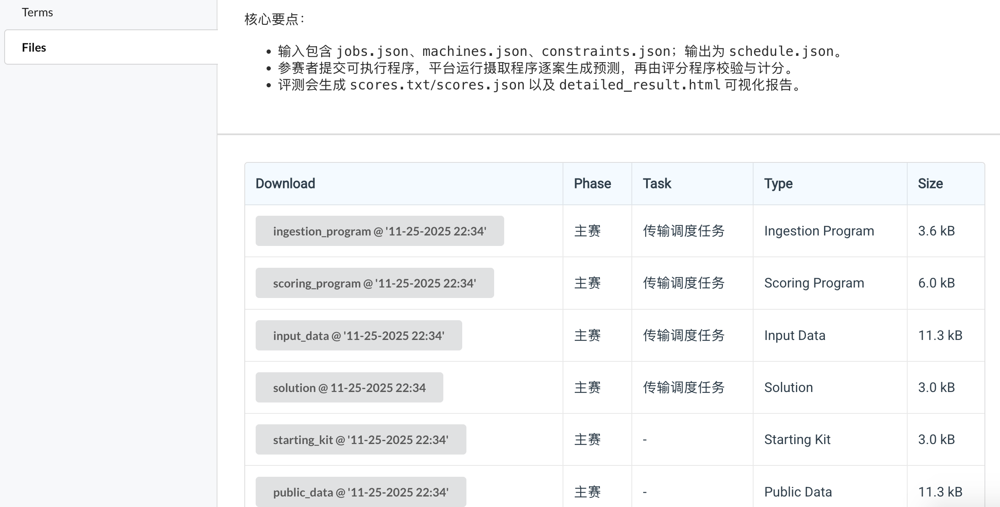
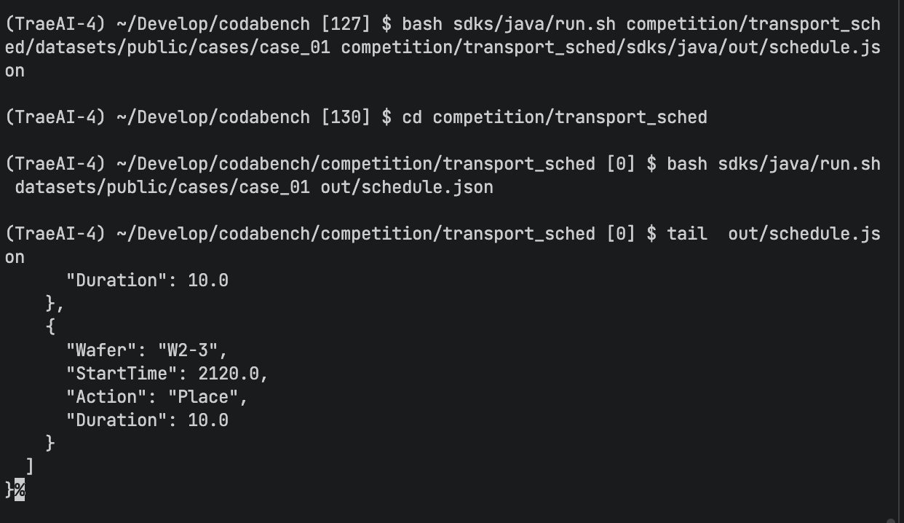
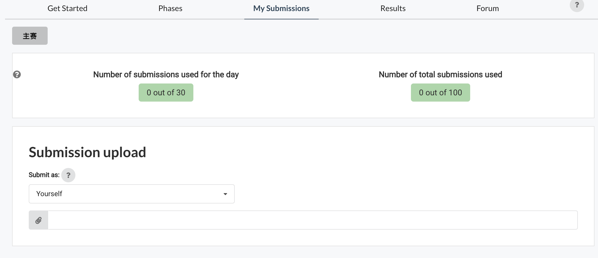
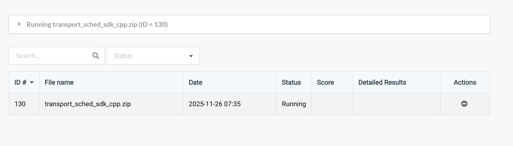
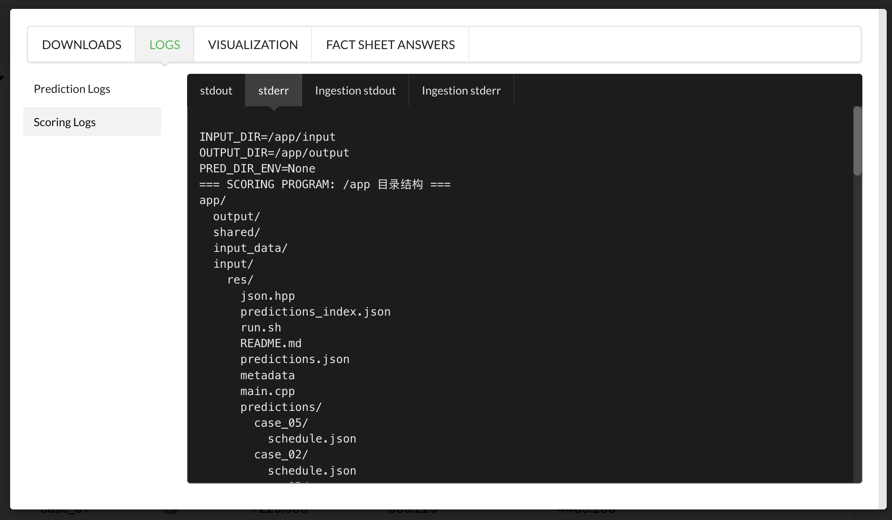
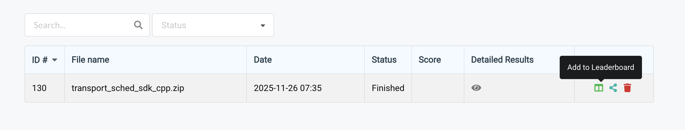

# 传输调度比赛参赛指南

## 1. 注册与登录
- 赛事方会为每一组参赛选手统一创建账号，并通过邮件/群通知 `用户名` 与临时 `密码`。首次登录后请立即修改密码。
- 默认不支持通过邮箱登录，服务未配置邮件发送与邮件找回功能。
- 如需自助注册，请在平台首页完成注册后登录。
- 登录入口为平台首页或赛事方指定链接。

## 2. 加入比赛
- 登录后进入 `基准/竞赛`，搜索并打开“传输调度 Benchmark
”比赛页面。
- 点击 `My Submission` 加入并同意比赛规则与条款。
- 页面主要栏目：`Get Started`、`Phases`、`My Submissions`、`Results`、`Forum`。

## 3. 文档与 SDK 下载
- 在 `Get Started` 页签左侧的 `概览`、`评分说明`、`数据与IO` 阅读赛题与评分细则。
- 在 `Get Started` → `Files` 下载 `starting_kit`、`ingestion_program`、`scoring_program`、`public_data` 等。
- 仓库亦提供 SDK 与示例：`sdks_all.zip` 及分语言 SDK（`sdks/python`、`sdks/cpp`、`sdks/c`、`sdks/java`）。
- 示例数据位于 `datasets/public/cases/`，每个用例目录包含：
  - `am.json`
  - `job.json`
  - `machine.json`
- 输出文件为 `schedule.json`（每个用例各一份）。

## 4. 本地开发与快速验证
- 程序入口约定（入口文件需位于提交 ZIP 根目录，支持以下其一）：
  - `run.sh <case_dir> <out_file>`
  - `run.py --input <case_dir> --output <out_file>`
  - `main.py --input <case_dir> --output <out_file>`
  - `predict.py::predict(case_dir, out_file)`
- 推荐在 `run.sh` 中使用 `make` 统一构建与运行，例如：`make build && make run CASE_DIR=<case_dir> OUT_FILE=<out_file>`。
- 语言示例与快速运行：
  - Python：`python3 sdks/python/run.py --input datasets/public/cases/case_01 --output cout/schedule.json`
  - C++：`bash sdks/cpp/run.sh datasets/public/cases/case_01 out/schedule.json`
  - C：`bash sdks/c/run.sh datasets/public/cases/case_01 out/schedule.json`
  - Java：`bash sdks/java/run.sh datasets/public/cases/case_01 out/schedule.json`

## 5. 在线提交代码
- 将入口文件与源代码、依赖说明打包为 ZIP；入口文件位于 ZIP 根目录。
- 上传提交后，平台会在容器中对每个用例调用你的入口（按上述约定），并在 `predictions/<case_id>/schedule.json` 收集结果用于评分。
- 运行环境版本：Python `3.10.x`、C `gcc 11.x`（建议 `-O2 -pipe -std=c11`）、C++ `g++ 11.x`（建议 `-O2 -pipe -std=c++17`）、Java `OpenJDK 17.x`。摄取阶段默认限制：`TIMEOUT_SECONDS=300`、`MEMORY_LIMIT_MB=2048`。

## 6. 查看执行反馈日志
- 打开比赛页面的 `Submissions`，进入你的提交详情，查看摄取与评分日志（包含容器目录结构与调试信息）。
- 在结果文件中查看 `scores.json`、`scores.txt` 与 `detailed_result.html`（包含各用例有效性与指标）。

## 6.1 重置/修改密码（无邮件）
- 在页面右上角用户菜单进入 `Profile/Settings`，选择 `Change Password`。
- 按提示输入 `旧密码`、`新密码` 与 `确认新密码` 后提交；无需邮箱。
- 遗忘旧密码时，请联系赛事管理员由后台重置；邮件重置入口默认不可用。

## 7. 选择最佳提交上榜
- 在 `Submissions` 列表中找到表现最好的提交，使用操作按钮将其加入排行榜或设为当前选中提交（平台可能显示为 `Add to Leaderboard`/`Select for Leaderboard`）。
- 切换到 `Leaderboard/Results` 页面确认榜单分数与排名。

## 8. 输出规范与校验要点
- `schedule.json` 为资源事件表，常见资源前缀包含 `AtmRobot`、`TMx-VacRobot`、`LoadLockx`、`PMx`。事件字段需包含：`StartTime`、`Duration`、`Action`（如 `Pick`/`Place`/`Vent`/`Pump`/`Execute`）、必要时包含 `Wafer` 标识。
- 校验规则要点：
  - 同一资源的时间片不可重叠，`Duration` 不可为负。
  - 事件时长需与 `machine.json` 的定义一致（如 `Pick/Place/Vent/Pump` 最小时长）。
  - `Execute` 事件需满足 `job.json` 中最后一步的最小时长与允许的 PM 集合；串行模式下不得“超车”。

## 9. 常见问题排查
- 入口未识别：确保提供 `run.sh`且位于提交 ZIP 根目录。
- 未生成 `schedule.json`：检查程序是否按传入的 `<case_dir>` 与 `<out_file>` 写出文件；平台会聚合到 `predictions.json` 与 `predictions_index.json`。
- JSON 结构错误：将导致该用例 `valid=false`，并在日志与报告中给出详细消息。
- 超时/内存限制：优化算法复杂度，确保在 300 秒与 2GB 内完成所有用例。

## 10. 快速检查清单
- ZIP 根目录包含入口文件，名称与参数约定正确。
- 本地对 `case_01` 成功生成 `schedule.json`.
- 提交后可在 `Submissions` 查看分数、日志与 `detailed_result.html`。
- 已在 `Leaderboard/Results` 将最佳提交加入榜单并确认排名。
